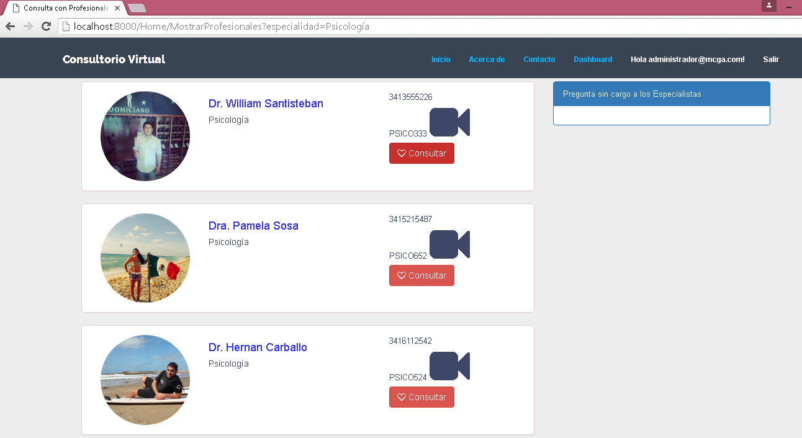
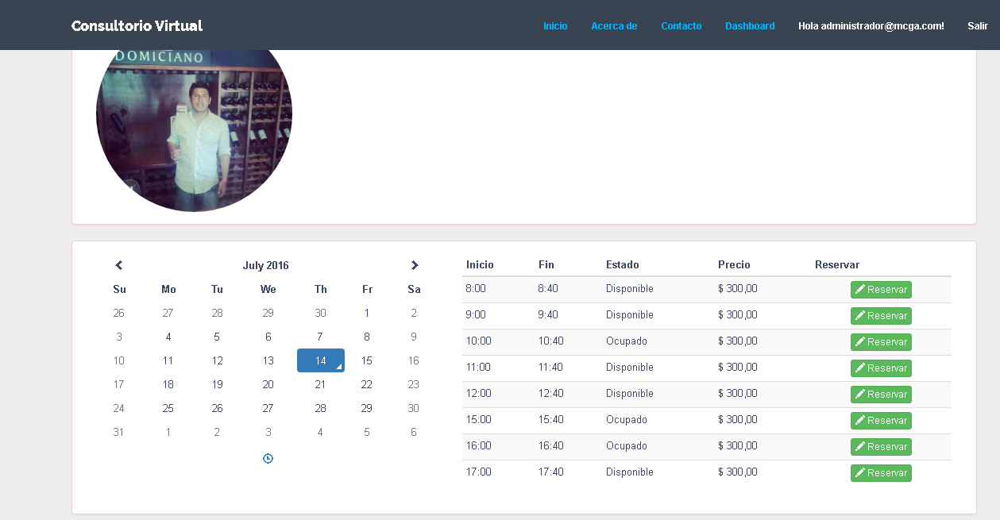
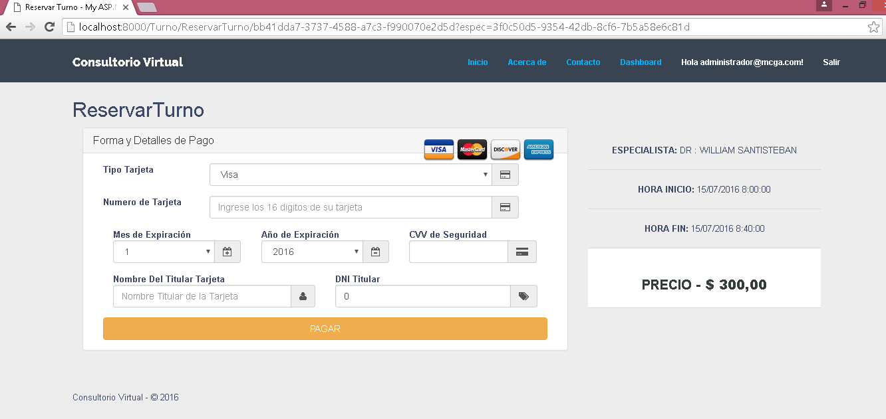

# Consultorio Virtual
Seminario Aplicación Profesional - SAP - 2016

Consultorio virtual es un e-business el cual agiliza la relación entre especialistas de la salud
y pacientes a través de consultas online vía videoconferencia permitiendo consultar a los
mejores profesionales de la salud en cualquier momento y desde cualquier lugar, ahorrando
tiempos, dinero y brindando respuestas inmediatas y calificadas.

# Login: 
Usuario : administrador@mcga.com  
Contraseña: Mcga@123456

# Cracks:  
-          # Agustin Stelzer : LinkedIn: https://ar.linkedin.com/in/agustin-stelzer-53a4486a
-          # William Gustavo Santisteban : LinkedIn: https://ar.linkedin.com/in/gustavosantisteban

